## 📖 프로젝트 소개

개인 회원(구직자)과 기업 회원(구인자)을 위한 채용 정보 플랫폼입니다. <br>
사용자는 이력서를 등록하고 원하는 채용 공고에 지원할 수 있으며, 기업은 채용 공고를 게시하고 지원자를 관리할 수 있습니다. <br>
또한, Q&A 커뮤니티와 상호 구독 기능을 통해 구인-구직자 간의 소통을 돕습니다.<br>

<br>

## ✨ 주요 기능

### **공통 기능**

-   **회원가입 및 로그인**: 개인/기업 유형에 따라 가입 및 로그인/로그아웃 기능 제공
-   **메인 페이지**: 사용자 유형에 따라 맞춤형 목록 제공 (개인: 채용공고, 기업: 이력서)
-   **Q&A 게시판**: 개인/기업 회원 모두 질문과 답변을 등록하고 댓글로 소통하는 기능
-   **기술 스택 필터링**: 원하는 기술 스택을 기준으로 채용공고 및 이력서 검색
-   **권한 관리**: 인터셉터를 이용해 사용자 유형별 페이지 접근 제어
-   **통합 예외 처리**: 4xx, 5xx 에러 발생 시 사용자에게 적절한 에러 페이지 안내

### **👤 개인 회원 (구직자)**

-   **이력서 관리**: 이력서 작성, 수정, 삭제 및 본인의 이력서 목록 관리
-   **채용공고 지원**: 원하는 채용공고에 지원 및 지원 취소
-   **지원 현황 관리**: 지원한 공고의 합격/불합격 상태를 확인
-   **기업 구독**: 관심 있는 기업을 구독하고, 해당 기업의 공고만 모아보기
-   **기업 평점**: 합격한 기업에 대해 평점을 등록하고 삭제하는 기능

### **🏢 기업 회원 (구인자)**

-   **채용공고 관리**: 채용공고 작성, 수정, 삭제 및 등록한 공고 목록 관리
-   **지원자 관리**: 자사 공고에 지원한 지원자 목록을 확인하고 합격/불합격 처리
-   **인재 구독**: 관심 있는 인재(개인 회원)를 구독하고, 해당 인재의 이력서만 모아보기
-   **이력서 조회**: 전체 구직자의 이력서 목록 및 상세 내용 조회

<br>

## 🛠️ 기술 스택

| 구분       | 내용                                                              |
| ---------- | ----------------------------------------------------------------- |
| **Backend**  | Java 17, Spring Boot 3.3.1, Spring Data JPA, Spring Security(Session) |
| **Frontend** | HTML, CSS, JavaScript, Bootstrap 5, Mustache                    |
| **Database** | MySQL 8.0                                                         |
| **API**      | Kakao Maps API                                                    |
| **Tools**    | Git, GitHub, IntelliJ IDEA                                        |

<br>

## 📸 주요 화면

### **✅ 공통 및 핵심 기능**

| 메인 (채용공고) | 이력서 목록 | Q&A 목록 |
| :---: | :---: | :---: |
| 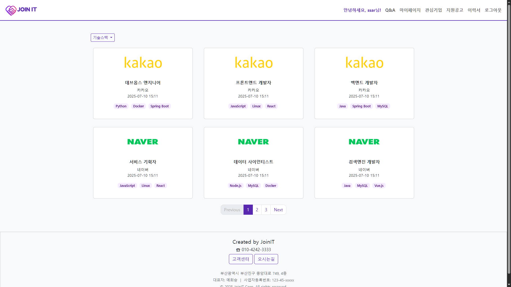 | 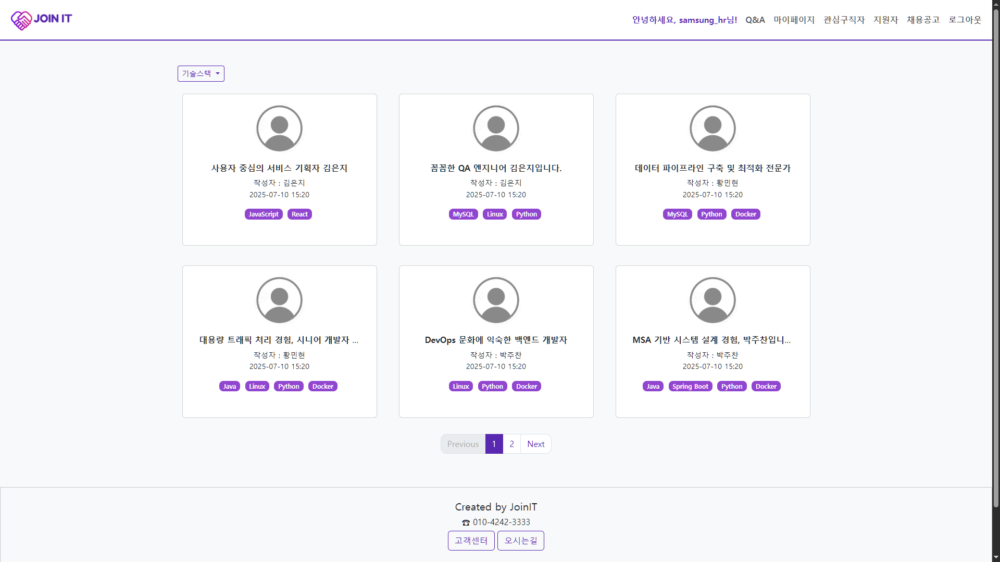 | 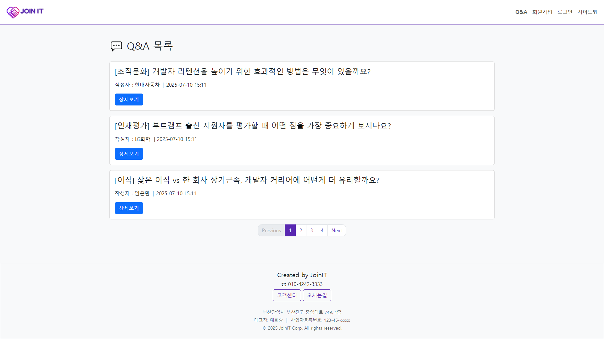 |
| **채용공고 상세** | **이력서 상세** | **Q&A 상세** |
| 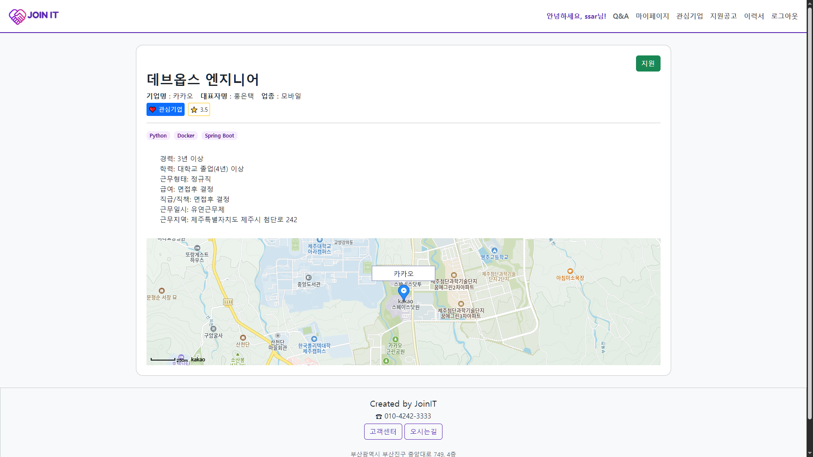 | 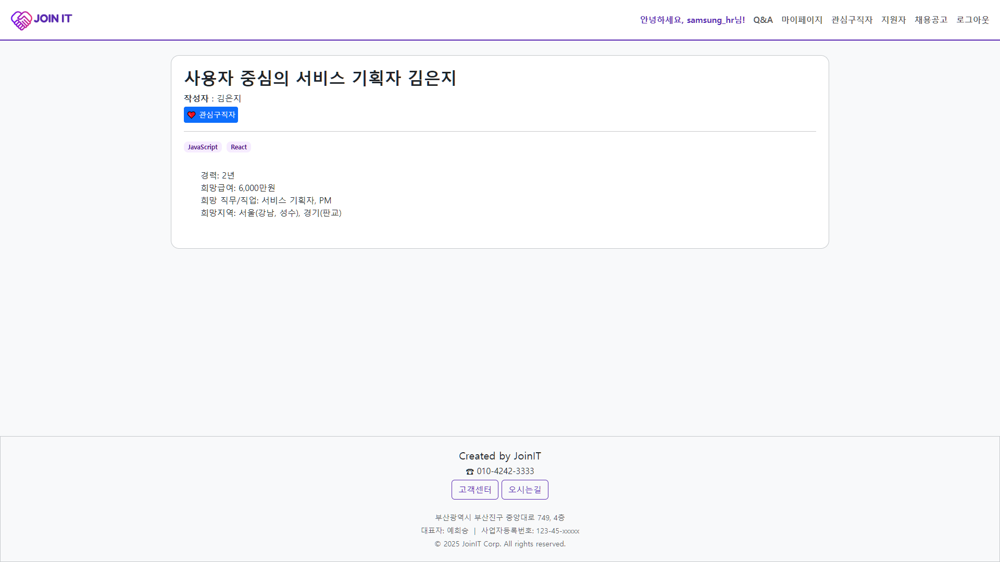 | 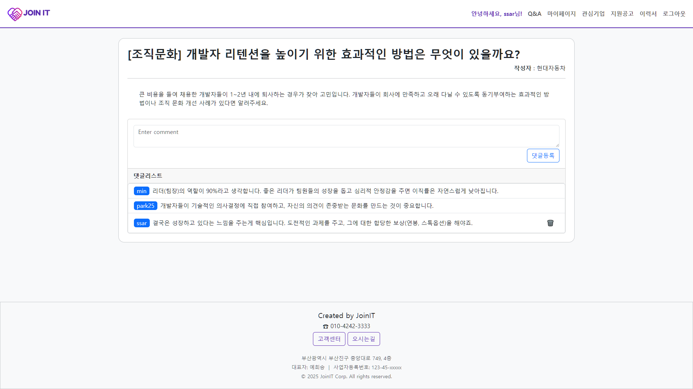 |

<br>

### **👤 개인 회원 기능**

| 회원가입 / 로그인 | 내 이력서 목록 | 지원 현황 |
| :---: | :---: | :---: |
| 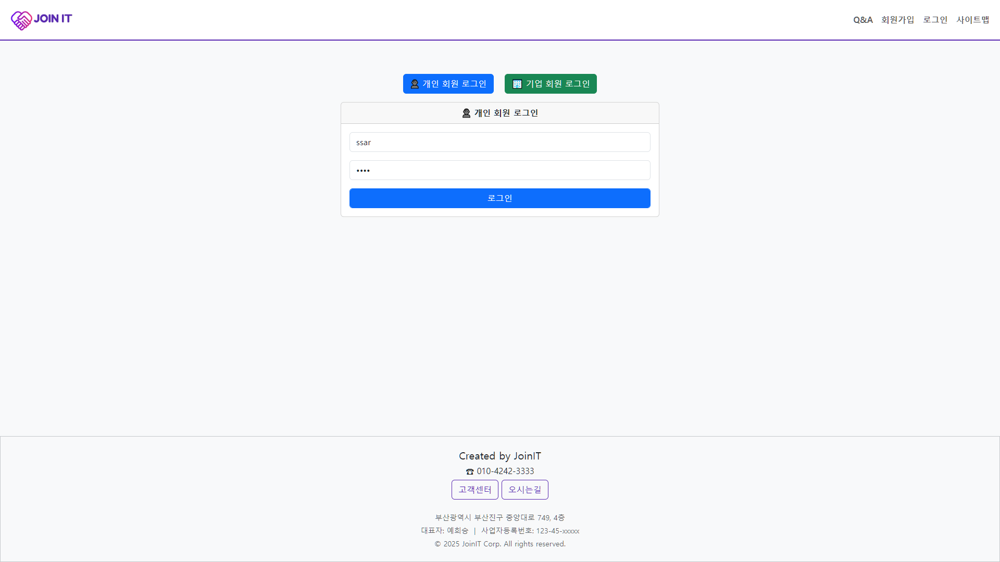 | 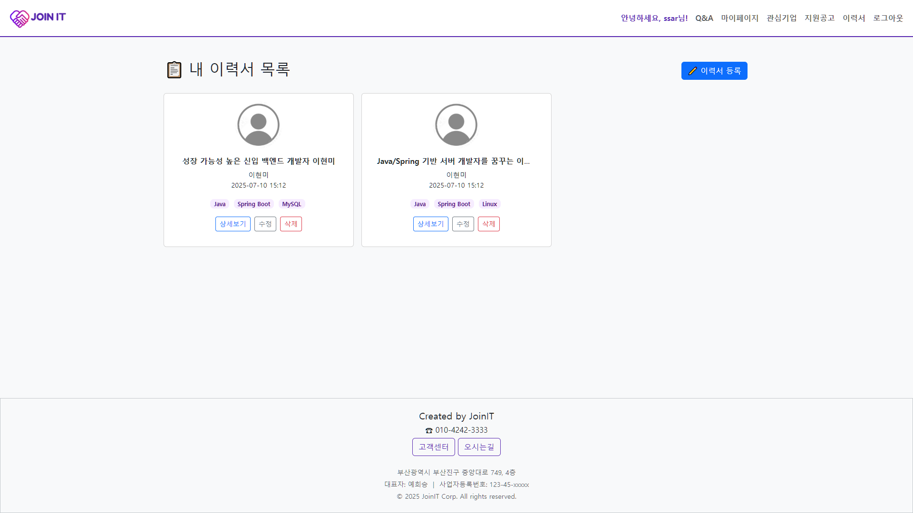 | 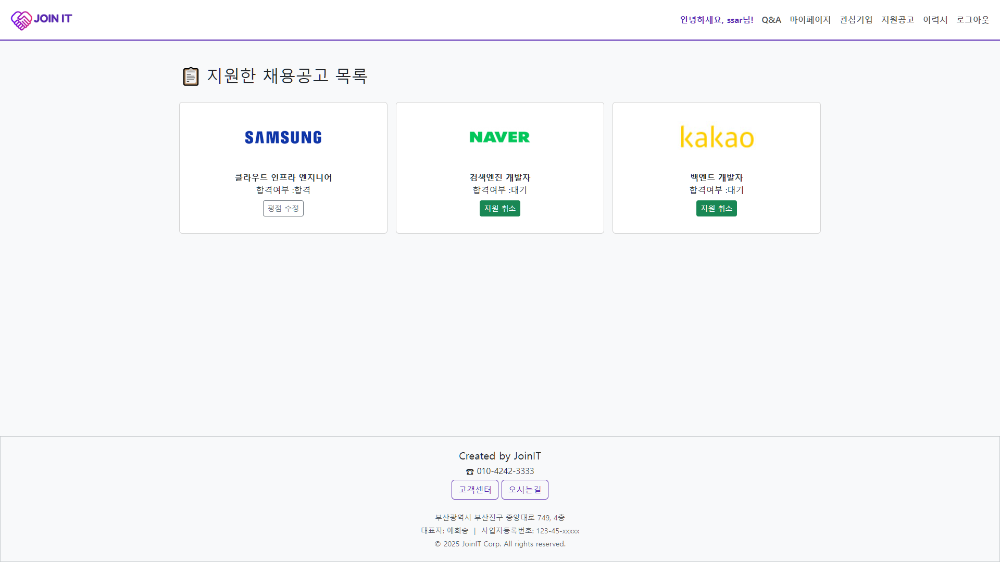 |
| **구독 기업 목록** | **구독 기업 공고** | **합격 기업 평점** |
| 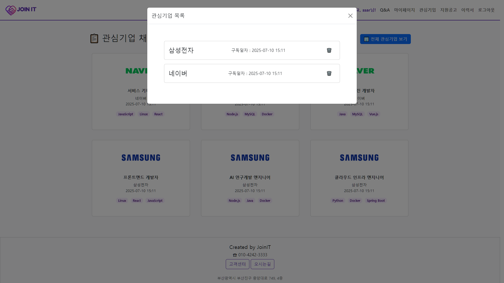 | 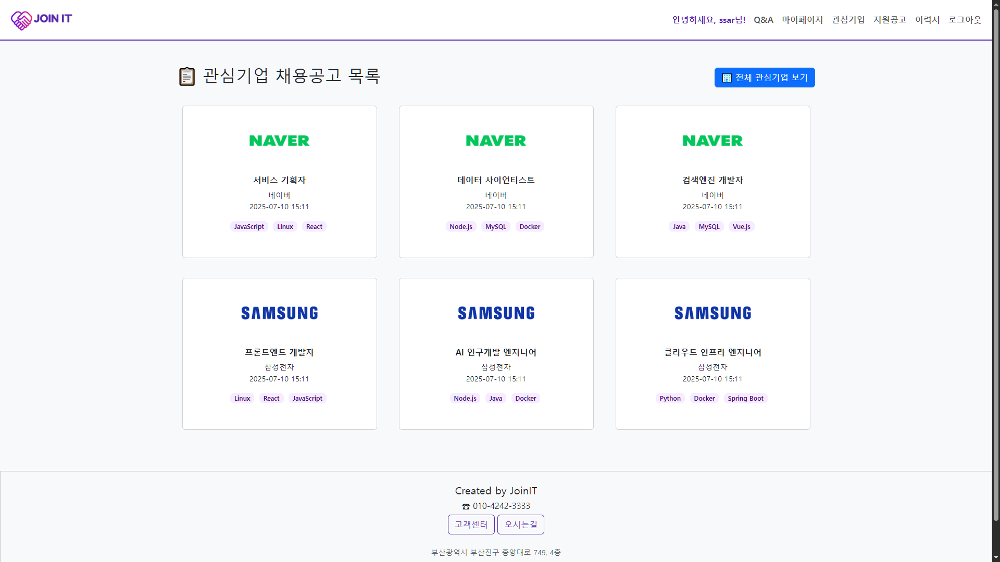 | 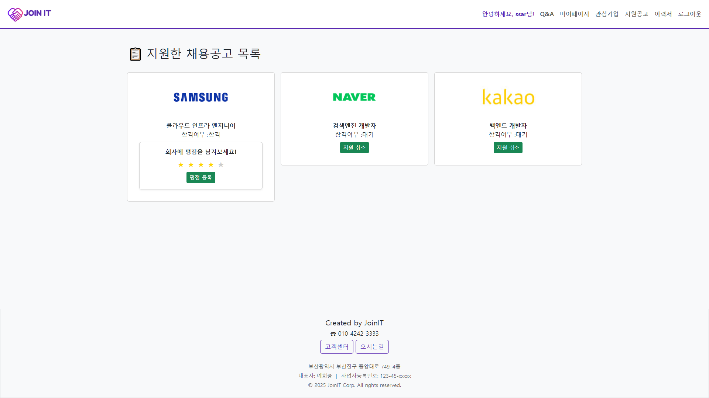 |

<br>

### **🏢 기업 회원 기능**

| 회원가입 / 로그인 | 지원자 관리 | 관심 인재 목록 |
| :---: | :---: | :---: |
| 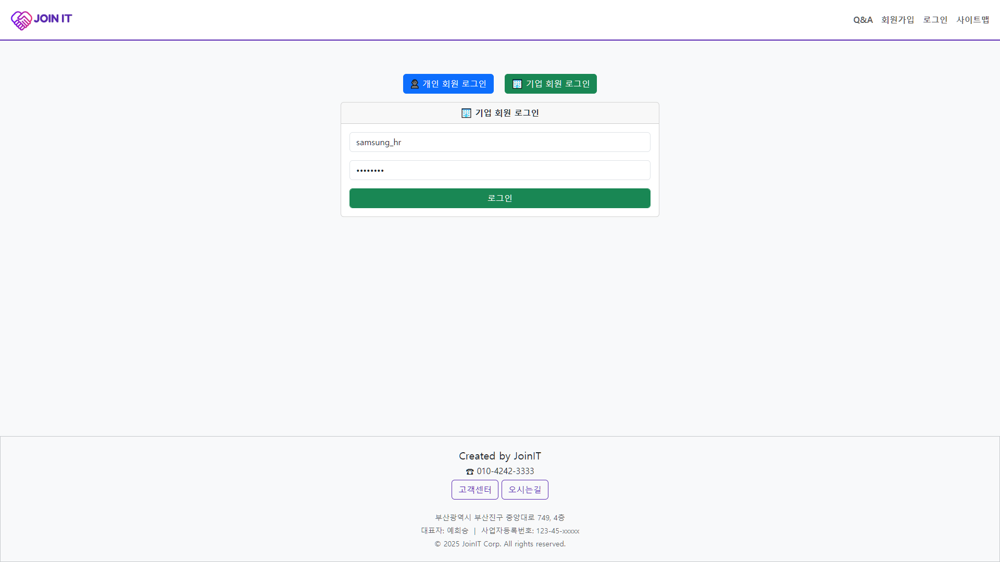 | 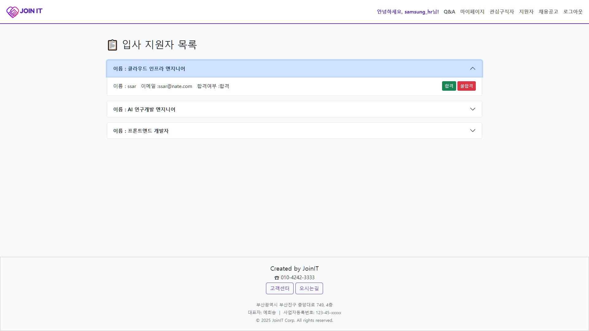 | 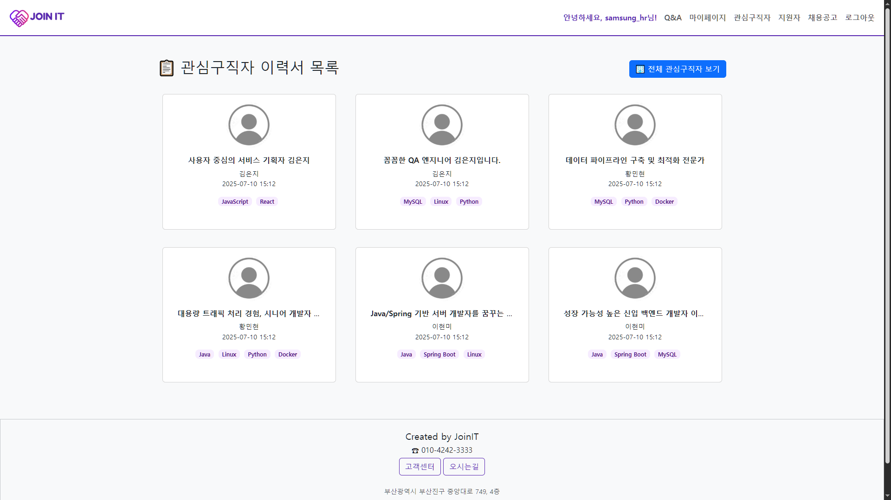 |

## 📄 ERD (Entity Relationship Diagram)

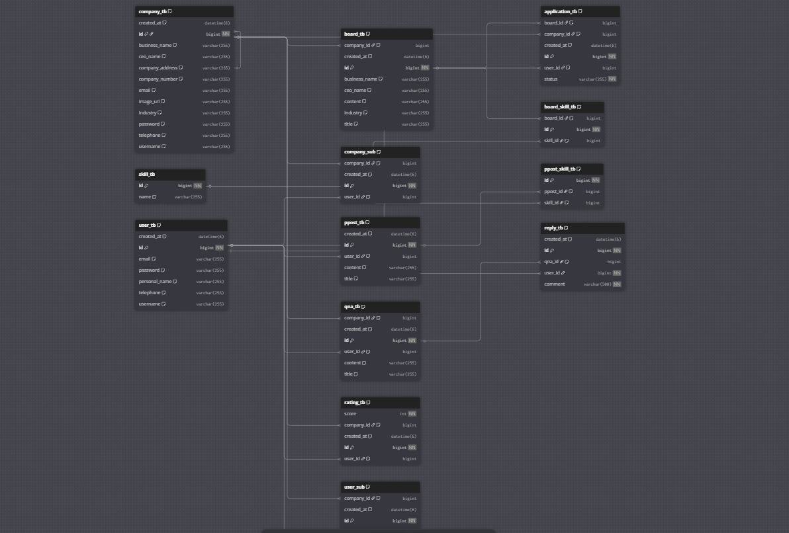

<br>

### 📄 데이터베이스 관계 설명

-   **👤 회원 (Users & Companies)**
    -   `user_tb`: **개인 회원(구직자)**의 정보를 저장하는 핵심 테이블입니다.
    -   `company_tb`: **기업 회원(구인자)**의 정보를 저장하는 핵심 테이블입니다.

-   **📄 핵심 콘텐츠 (Posts)**
    -   `ppost_tb` (이력서): **개인 회원(`user_tb`)**이 작성하는 이력서입니다. 한 명의 회원이 여러 이력서를 가질 수 있습니다. (1:N 관계)
    -   `board_tb` (채용공고): **기업 회원(`company_tb`)**이 등록하는 채용공고입니다. 한 기업이 여러 공고를 등록할 수 있습니다. (1:N 관계)

-   **🤝 상호작용 (Interactions)**
    -   `application_tb` (지원 내역): **개인 회원(`user_tb`)**이 **채용공고(`board_tb`)**에 지원한 내역을 기록합니다. `user_tb`와 `board_tb`를 연결하는 중요한 테이블입니다.
    -   `rating_tb` (평점): **개인 회원(`user_tb`)**이 합격한 **기업(`company_tb`)**에 대해 남긴 평점을 저장합니다.
    -   `user_sub` (개인의 기업 구독): **개인 회원(`user_tb`)**이 관심 있는 **기업(`company_tb`)**을 구독한 정보를 저장합니다. (다대다 관계)
    -   `company_sub` (기업의 인재 구독): **기업 회원(`company_tb`)**이 관심 있는 **인재(`user_tb`)**를 구독한 정보를 저장합니다. (다대다 관계)

-   **💬 커뮤니티 (Community)**
    -   `qna_tb` (Q&A 게시판): **개인 회원(`user_tb`)** 또는 **기업 회원(`company_tb`)**이 작성한 질문 게시글을 저장합니다.
    -   `reply_tb` (댓글): **Q&A 게시글(`qna_tb`)**에 **개인 회원(`user_tb`)**이 또는 **기업 회원(`company_tb`)**이 작성한 댓글을 저장합니다. (Q&A 게시글 하나에 여러 댓글이 달리는 1:N 관계)

-   **🛠️ 기술 스택 (Skills)**
    -   `skill_tb`: 'Java', 'React' 등 모든 기술 스택의 이름을 정의하는 마스터 테이블입니다.
    -   `board_skill_tb`: **채용공고(`board_tb`)**와 **기술 스택(`skill_tb`)**을 연결하여, 공고에 어떤 기술이 필요한지 나타냅니다. (다대다 관계)
    -   `ppost_skill_tb`: **이력서(`ppost_tb`)**와 **기술 스택(`skill_tb`)**을 연결하여, 구직자가 어떤 기술을 보유했는지 나타냅니다. (다대다 관계)

<br>

## 📁 프로젝트 구조
```
📦src
 ┗ 📂main
   ┣ 📂java
   ┃ ┗ 📂com
   ┃   ┗ 📂tenco
   ┃     ┗ 📂blog
   ┃       ┣ 📂_core (공통 모듈: 설정, 에러 핸들링, 인터셉터)
   ┃       ┣ 📂application (지원)
   ┃       ┣ 📂board (채용공고)
   ┃       ┣ 📂company (기업회원)
   ┃       ┣ 📂companySub (기업의 인재 구독)
   ┃       ┣ 📂ppost (이력서)
   ┃       ┣ 📂qna (Q&A 게시판)
   ┃       ┣ 📂rating (평점)
   ┃       ┣ 📂reply (댓글)
   ┃       ┣ 📂skill (기술스택)
   ┃       ┣ 📂user (개인회원)
   ┃       ┣ 📂UserSub (개인의 기업 구독)
   ┃       ┗ 📂utils (유틸리티)
   ┗ 📂resources
     ┣ 📂db (초기 데이터 SQL)
     ┣ 📂static (CSS, JS, 이미지)
     ┗ 📂templates (Mustache 템플릿)
       ┣ 📂_sitemap
       ┣ 📂board
       ┣ 📂company
       ┣ 📂err
       ┣ 📂layout
       ┣ 📂map
       ┣ 📂ppost
       ┣ 📂qna
       ┣ 📂reply
       ┣ 📂user
       ┗ 📂user-sub
```
